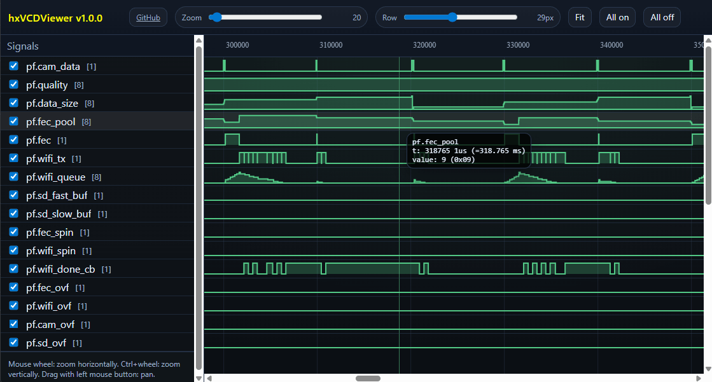

# hxVCDViewer
Simple **VCD file viewer** in **single HTML/CSS/JS File** for debugging microcontroller firmware.

Open **hxvcdviewer.html** in Chome locally,

or from github: https://romanlut.github.io/hxVCDViewer/hxvcdviewer.html

---
Load VCD data from **file**, **?url=** or pass **?data=** directly:

https://romanlut.github.io/hxVCDViewer/hxvcdviewer.html?url=https://raw.githubusercontent.com/RomanLut/hxVCDViewer/refs/heads/main/file.vcd

---

Receive VCD Data directly from microcontoller via UART 115200 8N1 surrounded with tags:

```
<<<VCDSTART>>>VCD content here...<<<VCDSTOP>>>
```

**TODO: release vcd_profiler.cpp**


